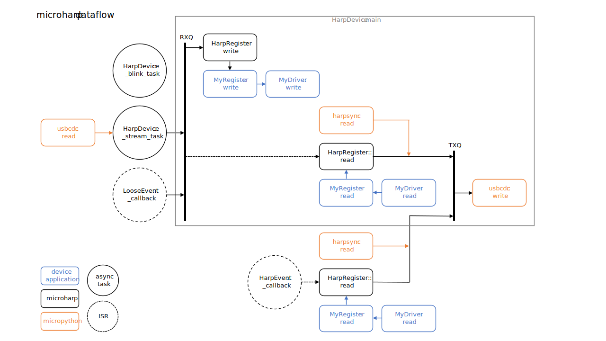

# Microharp

This Branch is under development

A Harp protocol and device application framework MicroPython package.

Microharp addresses a specific requirement, that is the rapid development of microcontroller-based peripherals which implement the functionality described in the [Harp Device](https://github.com/harp-tech/protocol/blob/master/Device%201.1%201.6%2020220524.pdf), [Harp Binary Protocol](https://github.com/harp-tech/protocol/blob/master/Binary%20Protocol%201.0%201.3%2020220621.pdf), and [Harp Synchronisation Clock](https://github.com/harp-tech/protocol/blob/master/Synchronization%20Clock%201.0%201.0%2020200712.pdf) specification documents. The Harp protocols are directly supported by Bonsai, and this is the primary use case for Microharp devices. Currently, Microharp targets the Raspberry Pi Pico only. So, Microharp is likely to be a great fit for any Bonsai peripheral application which can be realised using a Raspberry Pi Pico. In other cases, Microharp may not be the package you are looking for.

This document is divided into two sections, a tutorial and a developer guide. The first presents a step-by-step guide to installing the framework and creating a simple Microharp application. The second provides information for creating new Microharp applications and describes the inner workings of the package. The reader should have some familiarity with the Python programming language in the first instance and be proficient with it in the second.

## Tutorial

Since Bonsai targets Microsoft Windows, this tutorial assumes that a Windows PC will be used for development. A Raspberry Pi Pico will also be required. Note that the Raspberry Pi Pico has better tool support under Linux, whose users are invited to explore the [Raspberry Pi Pico Python SDK](https://datasheets.raspberrypi.com/pico/raspberry-pi-pico-python-sdk.pdf).

### Tool Installation

The following applications and tools should be downloaded and installed if not already present. Default installation options may be chosen if you are unsure which to select.

- [Bonsai](https://bonsai-rx.org/)
- [Thonny Integrated Development Environment](https://thonny.org/)
- [git Version Control Tool](https://git-scm.com/download/win) in order to access the repositories you will also need to [generate an SSH key](https://docs.github.com/en/authentication/connecting-to-github-with-ssh)

### Code Download

The SWC MicroPython binary and the Microharp package are maintained in this repository. Open Git Bash, navigate to your chosen working directory and clone the repository:

`git clone git@github.com:SainsburyWellcomeCentre/microharp.git`

### Code Installation

First, copy the SWC MicroPython binary to your Raspberry Pi Pico. Hold down the BOOTSEL button whilst connecting the USB cable to your PC, in Windows Explorer a drive volume named `RPI-RP2` will appear. Copy `bin/firmware.uf2` from the repository clone to the volume, the drive will then disappear as your Raspberry Pi Pico reboots into MicroPython.

Next, copy the Microharp package to your Raspberry Pi Pico. Open Thonny, you will see a message similar to:

```
Couldn't find the device automatically.
Check the connection (making sure the device is not in bootloader mode) or choose
"Configure interpreter" in the interpreter menu (bottom-right corner of the window)
to select specific port or another interpreter.
Likely candidates are:
 * USB Serial Device (COM3)
 * USB Serial Device (COM4)
```

Following this advice, navigate to "Configure interpreter" and select the lower numbered COM port under Interpreter>Details. In the Shell window you should now see the MicroPython REPL prompt:

```
MicroPython v1.18-4-g60923301a on 2022-10-17; Raspberry Pi Pico with RP2040
Type "help()" for more information.
>>>
```

Create a new directory named microharp, by right clicking on the Raspberry Pi Pico in the file view. Then save each of the .py files from the repository clone to the Raspberry Pi Pico microharp folder. This can be done by opening each of the .py files in the Thonny editor, selecting File>Save as, navigating to the Raspberry Pi Pico microharp folder and retyping the filename. Once this is complete the Raspberry Pi Pico file view will contain the following tree.

```
microharp
├── device.py
├── event.py
├── message.py
├── register.py
└── types.py
```

Microharp is now installed and ready to use on your device.

### Test Installation

Create a Python file containing the code below and save it to the root directory your device as `mymain.py`. Any file saved as `main.py` will automatically be executed the next time your device is powered up. So, whilst developing and debugging code it is useful to use a different name.

```
# Import standard library modules.
import uasyncio
from machine import Pin

# Import SWC library modules.
import usbcdc
import harpsync
from microharp.device import HarpDevice

# Instance a CDC and harpsync interface and an LED.
stream = usbcdc.usbcdc(1)
sync = harpsync.harpsync(0)
led = Pin(25, Pin.OUT)

# Instance a Harp device object and launch its application.
theDevice = HarpDevice(stream, sync, led)
uasyncio.run(theDevice.main())
```

Run the code and the LED should blink every 2 seconds.

Launch Bonsai, add a Harp.Device module to the workflow and select the correct PortName in its properties (this will be numbered one higher than your device REPL COM port). Once selected you will see the following output in the Bonsai console window, the Timestamp value will differ and is the time elapsed since your device booted.

```
Serial Harp device.
WhoAmI: 26354-0000
Hw: 1.0
Fw: 0.1
Timestamp (s): 103
DeviceName: Microharp Device
```

The Harp device name displayed in the Bonsai GUI will also update once clicked. Running and stopping the Bonsai workflow will put the device into active and standby modes respectively, which will be reflected by the blink rate of the LED.

### Hello World

With the Microharp installation verified, a custom device can now be created. Each Microharp application has its own device class, which must be a subclass of `HarpDevice`. Copy the code below and save it to a file named `mydevice.py`.

```
from microharp.device import HarpDevice
from microharp.types import HarpTypes
from microharp.register import ReadWriteReg

class MyDevice(HarpDevice):
    """My Harp device."""

    def __init__(self, stream, sync, led, trace=False):
        """Constructor.

        Connects the logical device to its physical interfaces and creates the register map.
        """
        super().__init__(stream, sync, led, trace=trace)

        registers = {
            HarpDevice.R_DEVICE_NAME: ReadWriteReg(HarpTypes.U8, tuple(b'Hello Microharp World!'))
        }
        self.registers.update(registers)
```

Open `mymain.py` and replace its contents with the code below.

```
# Import standard library modules.
import uasyncio
from machine import Pin

# Import SWC library modules.
import usbcdc
import harpsync
from mydevice import MyDevice

# Instance a CDC, a harpsync interface, and an LED.
stream = usbcdc.usbcdc(1)
sync = harpsync.harpsync(0)
led = Pin(25, Pin.OUT)

# Instance the device object and launch its application.
theDevice = MyDevice(stream, sync, led)
uasyncio.run(theDevice.main())
```

Launch Bonsai, reselect the Harp device and you will see that its name is now Hello Microharp World!

Whilst not particularly useful, this demonstrates that new Harp devices can be created with very little code when uisng Microharp. The new device class `MyDevice` inherits all the capabilities of `HarpDevice` and simply replaces its `DEVICE_NAME` register with an alternative one.

### Application Example

Typically, a Microharp application will contain some device specific registers. Copy the code below and save it to a file named `myregisters.py`.

```
from microharp.register import ReadWriteReg

class PrintReg(ReadWriteReg):
    """Read/write register with debug print."""

    def read(self, typ):
        print(f'PrintReg.read value = {self.value}')
        return super().read(typ)

    def write(self, typ, value):
        super().write(typ, value)
        print(f'PrintReg.write value = {self.value}')
```

Open `mydevice.py` and replace its contents with the code below.

```
from micropython import const

from microharp.device import HarpDevice
from microharp.types import HarpTypes
from microharp.register import ReadWriteReg

from myregisters import PrintReg

class MyDevice(HarpDevice):
    """My Harp device."""

    R_PRINT_VAL = const(32)

    def __init__(self, stream, sync, led, trace=False):
        """Constructor.

        Connects the logical device to its physical interfaces, creates the register map.
        """
        super().__init__(stream, sync, led, trace=trace)

        registers = {
            HarpDevice.R_DEVICE_NAME: ReadWriteReg(HarpTypes.U8, tuple(b'My Microharp Device')),
            MyDevice.R_PRINT_VAL: PrintReg(HarpTypes.S16)
        }
        self.registers.update(registers)
```

Insert a Harp.CreateMessage module before the Harp.Device module in your Bonsai workflow. Set the properties of the CreateMessage module as follows: Address = 32, MessageType = Write, Payload = -42, PayloadType = S16. Run the workflow and you will see the following output in the Thonny Shell window.

```
PrintReg.write value = (-42,)
PrintReg.read value = (-42,)
```

The device specific register `PrintReg` has been written to by the Harp message, it has also been read whilst generating a Harp response. Incidentally, the Harp response has also been timestamped, an operation that is transparently handled by `HarpDevice`. Note that the register value is a tuple, this is because Harp registers have a depth of up to 255 values.

This example illustrates the basic principle of creating a Microharp application with a device specific register. The register simply wrote to the console, but it could have been bound to a hardware driver.

## Developer Guide

A Microharp based device is built on a three-layer software stack. These will be described from the top down, with reference to the figure below, in the following sections.



### Device Application

A Microharp device typically has one or more hardware interfaces whose ports are mapped, by some function, to one or more Harp registers. With reference to the figure, a hardware interface is supported by `MyDriver` and the associated Harp register is implemented by `MyRegister`. It is the responsibility of the driver to implement the hardware dependant part of the mapping function, presenting a Pythonic interface to the register. The register maps a Harp datatype to the driver interface, this may include a complex function with or without internal state. The driver and register are instanced and bound to one another in the custom device class constructor. The register is then added to the device register dictionary, making it available to the underlying application framework. Harp read and write message reception result in register read and write operations. To generate a Harp event message, one of the event classes must be instanced in the custom device class constructor and bound to its associated register. The [Virtual Hunting](https://github.com/SainsburyWellcomeCentre/virt-hunt-drv), [Perturbation Treadmill](https://github.com/SainsburyWellcomeCentre/pert-tread-drv), and [Responsive Joystick](https://github.com/SainsburyWellcomeCentre/resp-joystick) projects are examples of Microharp best practice, the reader is encouraged to study and understand them. It is very likely that design patterns which addresses the requirements of your application can be found in these projects.

The Microharp application framework uses MicroPython's `uasyncio` module to provide a co-operative multitasking runtime environment. Each concurrent task must to yield to the scheduler at regular intervals. Register and driver code runs in the context of the `HarpDevice.main` task, unless the register is bound to a `HarpEvent` in which case read operations run in interrupt context. In the former case user code must execute within a millisecond or so, in the latter case it must execute within the order of tens of microseconds. It is advised to make use of `LooseEvents` to avoid this constraint. A `LooseEvent` has a timestamp accuracy of around one millisecond, which is more than adequate for any electromechanical system application. A `HarpEvent` has a timestamp accuracy of around 100 microseconds and may be required for audio or visual stimulus systems in which events need to be correlated with neural imaging data. As is true for all software systems, Microharp performance is primarily dependant on algorithm selection, rather than its implementation language. _"The real problem is that programmers have spent far too much time worrying about efficiency in the wrong places and at the wrong times; premature optimization is the root of all evil (or at least most of it) in programming - Donald Knuth."_ However, some useful advice can be found here [Maximising MicroPython speed](https://docs.micropython.org/en/v1.18/reference/speed_python.html?highlight=speed). And, for `HarpEvents` the advice here [Writing interrupt handlers](https://docs.micropython.org/en/v1.18/reference/isr_rules.html?highlight=interrupts) must be adhered to.

### Microharp

The application framework provides support for the following:

- [Harp datatypes](types.py)
- [Harp message parsing and formatting](message.py)
- [Harp registers](register.py)
- [Harp events](event.py)
- [Harp common device functionality](device.py)

Note that the Microharp design philosophy is to _not_ modify or extend Microharp. All device specific functionality should be implemented in the device application. Currently, Microharp implements all of the mandatory Harp common device features and some of the optional features. If an optional feature is required that is not currently implemented, this is a valid case for extension. However, to prevent spawning multiple configurations, any modification to Microharp must be backward compatible with existing Microharp applications.

Harp messages from the host are received and validated by `_stream_task`, then posted to a receive message queue for processing by the `HarpDevice` main loop. `LooseEvents` also post messages to the receive queue, providing a mechanism for event processing with minimal interrupt context overhead at the expense of timestamp accuracy. Reception of Harp messages of any type cause register and current timestamp read operations, write messages also cause register write operations to be performed prior to the read. Register and tiemstamp data are formatted for transmission and posted to a transmit message queue. `HarpEvents` also post messages to the transmit queue, providing a mechanism for event processing with minimal latency variation. The transmit message queue is finally emptied by the `HarpDevice` main loop.

### MicroPython

A [fork](https://github.com/SainsburyWellcomeCentre/micropython/tree/v1.18-swc) of the MicroPython project with features added to the `rp2` port that provide low level functionality required by Microharp.

Note that the Microharp design philosophy is to _not_ modify or extend MicroPython. Microharp applications are written in Python, but MicroPython is written in C. Application development using a single language and toolchain is preferable to two. Furthermore, to prevent spawning multiple configurations, any modification to MicroPython must be backward compatible with existing Microharp applications.

The changes that were made to MicroPython are justified as follows. `usbcdc` requires C binding to the USB stack since this API is not exposed by MicroPython. `harpsync` requires installation of a UART interrupt handler since data arrival events uniquely represent timing information on this interface. Lastly, the extension to `machine.UART` requires access to a hardware register that is not exposed by MicroPython. Each of these changes has been made with careful consideration of possible side effects and respects the coding style and conventions of the MicroPython authors. In summary, think carefully before modifying or extending MicroPython! If changes are required, they should be made and documented on the SWC branch. This was taken from the v1.18 release of MicroPython. It may be necessary to merge the SWC branch into a later MicroPython release in the future, for example if a new MicroPython feature or bug-fix is required, but until such a requirement arises there is no benefit in doing so.

Whilst it is theoretically possible to setup a Windows environment capable of compiling MicroPython for the Raspberry Pi Pico, it is less effort to install [Windows Subsystem for Linux](https://learn.microsoft.com/en-us/windows/wsl/install). A Linux toolchain installation and build process for MicroPython is well supported and described in [Raspberry Pi Pico Python SDK](https://datasheets.raspberrypi.com/pico/raspberry-pi-pico-python-sdk.pdf).

If it is desired to port Microharp to a different microcontroller it will be necessary to implement the `usbcdc` and `harpsync` modules for the new target architecture. This essentially involves adding code with equivalent functionality to `ports/rp2/modusbcdc.c` and `ports/rp2/modharpsync.c` to the new port. The effort involved in doing so will depend on the new target's C SDK implementation, toolchain, and documentation.

## Further reading

The following official resources are recommended reading:

- [The Python Tutorial](https://docs.python.org/3/tutorial/index.html)
- [The Zen of Python](https://peps.python.org/pep-0020)
- [MicroPython documentation](https://docs.micropython.org/en/v1.18)
- [MicroPython usermod](https://micropython-usermod.readthedocs.io/en/latest/index.html)
